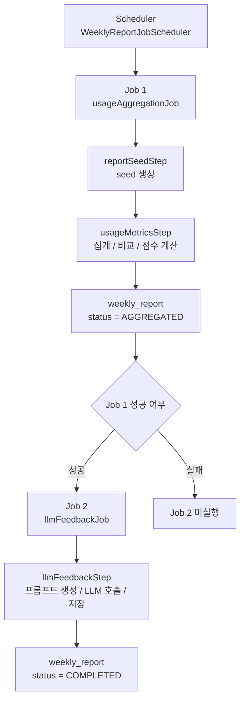

# 📘 주간 AI 분석 리포트 아키텍처

---

## 🔄 전체 흐름

주간 AI 분석 리포트는 하나의 Job에서 모든 처리를 끝내지 않고, 성격이 다른 두 개의 Job을 순차 실행하는 구조로 구성되어 있다.

### 🗺️ 전체 흐름도

### 🧩 흐름 요약

- 입력 기준: `targetDate` 또는 KST 현재 날짜
- 집계 범위: 기준일 - 7일 ~ 기준일 - 1일
- 중간 산출물: `weekly_report`, `AGGREGATED`
- 최종 산출물: `weekly_report`, `COMPLETED`

### 1. `usageAggregationJob`

- 리포트 대상자 선정
- `weekly_report` seed 생성
- Redis 사용량 원천 데이터 조회
- 지난 주 스냅샷 조회 및 비교
- 점수, 태그, 요약 데이터, 차트 데이터 계산
- `weekly_report` 업데이트
- 상태 전이: `PENDING -> AGGREGATED`

### 2. `llmFeedbackJob`

- `AGGREGATED` 상태 리포트 조회
- 프롬프트 생성
- 외부 LLM API 호출
- AI 피드백 저장
- 상태 전이: `AGGREGATED -> COMPLETED`

### 3. 스케줄 실행 흐름

- 실행 주체: `WeeklyReportJobScheduler`
- 실행 순서: `usageAggregationJob` 선행 실행
- 후속 조건: `usageAggregationJob` 성공 시 `llmFeedbackJob` 실행
- 실행 기준일: `targetDate` 또는 KST 현재 날짜
- 집계 기간: 기준일 - 7일 ~ 기준일 - 1일

### 4. 상태값 기준

- `PENDING`: seed 생성 완료, 집계 대기 상태
- `AGGREGATED`: 집계 및 점수 계산 완료, AI 생성 대기 상태
- `COMPLETED`: AI 피드백 저장 완료 상태
- `FAILED`: 실패 상태

---

## 🏗️ Job 1. `usageAggregationJob`

`usageAggregationJob`은 주간 리포트의 정형 데이터 계산을 담당한다.
메인 DB, 배치 DB, Redis를 사용해 리포트를 AI 생성 직전 상태까지 만드는 Job이다.

### 구성

- `reportSeedStep`
- `usageMetricsStep`

---

## 1-1. `reportSeedStep`

이번 주 리포트를 생성해야 하는 대상자 목록을 `weekly_report`에 seed로 적재하는 단계다.

### 처리 역할

- Reader: 메인 DB 대상자 조회
- Processor: 리포트 기간 계산 및 seed 객체 생성
- Writer: 배치 DB `weekly_report` 벌크 insert

 

### Reader 세부 사항

`ReportSeedReaderConfig`는 메인 DB에서 CHILD 회선을 조회한다.
주요 조건은 다음과 같다.

- `family_report.receive_day = 현재 실행 요일`
- `family_report.is_active = true`
- `member.is_deleted = false`
- `subscription.is_deleted = false`
- `family_sub.family_role = 'CHILD'`

 

### Processor 세부 사항

`ReportSeedProcessor`는 `targetDate`를 기준으로 주간 시작일과 종료일을 계산한다.
생성 결과는 `WeeklyReport` seed 객체이며 초기 상태는 `PENDING`이다.

 

### Writer 세부 사항

`ReportSeedWriterConfig`는 `weekly_report`에 insert한다.
중복 처리 방지를 위해 아래 제약을 사용한다.

- `ON CONFLICT (sub_id, week_start_date) DO NOTHING`

 

### 이 Step을 분리한 이유

- 대상 선정 로직과 집계 로직의 분리
- seed 생성의 멱등성 확보
- 재실행 기준의 단순화
- 후속 Step이 `weekly_report`만 기준으로 동작 가능한 구조

---

## 1-2. `usageMetricsStep`

`usageMetricsStep`은 `weekly_report`의 집계 대상을 읽어 사용량 집계, 지난 주 비교, 점수 계산, 태그 도출을 수행하는 핵심 단계다.

### 구성

- Master Step: `usageMetricsStep`
- Worker Step: `usageMetricsWorkerStep`
- 파티셔닝 방식: `MOD(weekly_report_id, gridSize)` 기반 분산

### 🤔 왜 파티셔닝 구조인가

이 단계는 단순 DB 조회가 아니라 여러 저장소와 계산 단계를 동시에 포함한다.

- 배치 DB 대상 조회
- Redis 앱별 사용량 조회
- Redis 시간대별 사용량 조회
- 배치 DB 지난 주 스냅샷 조회
- CPU 기반 집계 및 비교 계산
- 배치 DB update

단일 스레드 구조에서는 Redis round trip, JSON 직렬화, DB update가 직렬화되기 때문에 처리 시간이 길어질 수밖에 없다.
따라서 Worker Step을 병렬로 실행해 처리량을 분산하도록 설계했다.

> ⚙️ 설계 포인트
> 이 Step은 단일 저장소 batch가 아니라 `DB + Redis + CPU 계산`이 한 번에 묶인 구간이므로, 병렬 처리 구조가 사실상 필수에 가깝다.

 

### 파티셔닝 세부 사항

`WeeklyReportPartitioner`는 `startId/endId` 범위를 나누지 않고 아래 값을 각 파티션에 전달한다.

- `gridSize`
- `remainder`

Reader는 아래 조건으로 데이터를 읽는다.

- `MOD(weekly_report_id, :gridSize) = :remainder`

이 방식을 택한 이유는 다음과 같다.

- 특정 ID 구간으로 몰리는 파티션 불균형 완화
- 단순한 계산 방식
- 함수 기반 인덱스와 결합 가능한 구조
- 전체 대상의 상대적으로 균등한 분산 가능성

---

## 1-2-1. Reader 세부 사항

`UsageMetricsReader`는 단순 Paging Reader가 아니라, Chunk 단위 사전 데이터 결합 Reader다.

### 동작 흐름

1. `weekly_report`에서 이번 주 대상 `200건` 조회
2. Chunk 내 `sub_id` 목록 수집
3. 앱별 사용량 Redis 조회
4. 시간대별 사용량 Redis 조회
5. 지난 주 스냅샷 DB 조회
6. 결과 병합 후 `UsageMetricsAggregationInput` 버퍼링
7. Processor에 순차 전달

### 핵심 설계 포인트

- Reader 단계에서 필요한 주변 데이터를 먼저 모아두는 구조
- Processor 단계의 계산 집중 구조
- item 단위 추가 조회 방지 구조

> 🚨 주요 병목 개선 포인트  
> 한 건씩 읽고 한 건씩 Redis/DB를 다시 조회하는 구조를 피하고, Chunk 단위로 필요한 데이터를 먼저 결합하는 방식

### Redis 조회 방식

- `executePipelined` 사용
- `sub_id` 50건 단위 그룹 분할
- 앱 사용량과 시간대 사용량 각각 병렬 Future 실행
- 전용 I/O 스레드풀 기반 병렬 처리

### 지난 주 스냅샷 조회 방식

- 동일 주차 처리 가정 사용
- 지난주 시작일 고정
- `sub_id in (...) and week_start_date = :lastWeekStartDate` 벌크 조회

---

## 1-2-2. Processor 세부 사항

`UsageMetricsProcessorImpl`는 계산 책임을 세 개의 서비스로 분리한다.

### `UsageAggregationService`

- 이번 주 사용량 원천 데이터 요약
- 총 사용량 계산
- 일별, 시간대별, 카테고리별 구조화

### `ComparisonCalculationService`

- 이번 주 집계 결과와 지난 주 스냅샷 비교
- 증감 계산
- summary / usageList 데이터 조합

### `ReportInsightService`

- 점수 계산
- 태그 도출
- 비즈니스 인사이트 생성

### Processor 설계 포인트

- 계산 책임 분리
- 집계 규칙과 비교 규칙 분리
- CPU 병목 구간 추적 가능 구조
- 단계별 실행 시간 측정 가능 구조

> 🧠 계산 구조 포인트  
> 집계, 비교, 인사이트 계산을 분리해 어느 단계에서 CPU 시간이 많이 쓰이는지 추적 가능한 구조

`UsageMetricsProcessorImpl`는 내부적으로 아래 구간을 `nanoTime`으로 측정할 수 있게 구성되어 있다.

- Aggregation 시간
- Comparison 시간
- Insight 시간
- JSON Serialization 시간

---

## 1-2-3. Writer 세부 사항

`UsageMetricsWriter`는 계산 결과를 `weekly_report`에 update한다.

### 저장 항목

- `total_usage`
- `score_data`
- `tags`
- `summary_data`
- `usage_list_data`
- `report_status`

### Writer 설계 포인트

- `PGobject` 기반 `jsonb` 저장
- SQL Array 기반 태그 저장
- JDBC batch update 중심 구조

### 직렬화 위치 조정

`WeeklyReport`에는 아래 미리 직렬화된 필드가 포함된다.

- `scoreJson`
- `summaryJson`
- `usageListJson`

이 구조의 목적은 Writer에서 JSON 직렬화 연산을 다시 수행하지 않도록 만드는 것이다.
즉, Writer는 계산 계층이 아니라 저장 계층으로 동작하도록 단순화되어 있다.

> 📦 Writer 최적화 포인트  
> 저장 직전 계산을 줄이고, JDBC batch update에 집중하도록 역할을 축소한 구조

---

## 🤖 Job 2. `llmFeedbackJob`

`llmFeedbackJob`은 정형 데이터 계산이 아니라 외부 LLM API 연동을 담당한다.
이 단계의 핵심은 CPU 연산이 아니라 외부 API 대기 시간과 실패 제어다.

### 구성

- `llmFeedbackStep`

### Job 분리 이유

- 외부 API 장애와 집계 장애의 분리
- 집계 완료 리포트 기준 재실행 가능 구조
- 모델 변경, 프롬프트 변경 실험과 정형 집계 로직 분리
- DB/Redis 튜닝과 외부 API 튜닝의 분리

> 🔌 분리 효과  
> Job1은 정형 데이터 집계, Job2는 외부 API orchestration 역할로 분리되어 운영 책임도 함께 나뉘는 구조

---

## 2-1. `llmFeedbackStep`

`llmFeedbackStep` 역시 Master/Worker 파티셔닝 구조를 사용한다.

### 구성

- Master Step: `llmFeedbackStep`
- Worker Step: `llmFeedbackWorkerStep`
- 파티셔닝 방식: ID range 기반 분할

### 파티셔닝 세부 사항

`LlmFeedbackPartitioner`는 `AGGREGATED` 상태 row의 최소/최대 ID를 조회한 뒤, `startId ~ endId` 범위를 파티션별로 분배한다.

이 단계가 ID range 방식을 쓰는 이유는 다음과 같다.

- Redis 사전 로드 같은 추가 조회 부하 없음
- `weekly_report` 단일 테이블 중심 처리 구조
- 단순한 범위 분할로 충분한 구조

---

## 2-1-1. Reader 세부 사항

`LlmFeedbackReaderConfig`는 아래 대상을 읽는다.

- `report_status = AGGREGATED`
- 현재 파티션의 `startId ~ endId` 범위 내 row

### Reader 특징

- 메인 DB 의존 없음
- Redis 의존 없음
- `weekly_report`에 저장된 정형 데이터 재사용 구조

읽어오는 주요 필드는 다음과 같다.

- `score_data`
- `tags`
- `summary_data`
- `usage_list_data`

---

## 2-1-2. Processor 세부 사항

`LlmFeedbackProcessor`는 실제 delegate를 `AsyncItemProcessor`로 감싼 async 구조다.

### 처리 흐름

1. `PromptManager` 프롬프트 생성
2. `LlmApiClient` 외부 API 호출
3. 응답 JSON 역직렬화
4. `LlmFeedbackWeeklyReport` 조합

### async 구조를 사용한 이유

- 외부 API 호출의 대기 시간 병목
- 순차 호출 시 낮은 처리량
- 병렬 호출 필요성
- 무제한 병렬 호출 방지 필요성

즉, 이 단계는 비동기 호출과 병렬성 제한을 동시에 가져가는 구조다.

> ⏱️ Job2 핵심 포인트
> Job2는 계산 속도보다 외부 API 대기 시간과 실패 제어가 더 큰 성능 변수

---

## 2-1-3. PromptManager 세부 사항

`PromptManager`는 프롬프트 파일을 매건 읽지 않는다.

### 적용 방식

- 애플리케이션 시작 시 1회 로드
- 시스템 메시지 / 사용자 메시지 분리
- 메모리 캐시 유지

### 목적

- 반복 파일 I/O 제거
- 프롬프트 바인딩 전용 구조
- 배치 처리량 저하 방지

---

## 2-1-4. 외부 API 호출 세부 사항

외부 API 호출 계층은 `WebClient`와 `Resilience4j`를 중심으로 구성되어 있다.

### 구성 요소

- `WebClient`
- Connection Pool
- RateLimiter
- Retry

### 주요 설정

- `max-connections: 500`
- `pending-acquire-max-count: 1000`
- `connect/read timeout` 분리
- Rate limit: `1초당 15건`
- Retry: 최대 `3회`
- Exponential backoff: `2s -> 4s -> 8s`

### 이 단계의 핵심 병목

- API 응답 지연
- 429
- 503
- timeout

즉, Job2의 핵심은 CPU 최적화보다 동시성 제어와 실패 제어다.

---

## ⚡ 성능 개선

### 📌 측정 범위

- 측정 대상: `usageAggregationJob` 기준 최적화
- 처리 건수: `57,005건`
- 비교 제외: `llmFeedbackJob`
- 제외 이유: 현재 `llmFeedbackJob`은 `MockLlmApiClient` 기준 처리이며, 실제 외부 LLM API 지연 시간과 비용이 반영되지 않은 상태

### 📊 57,005건 기준 성능 개선표

| 항목            | 처리 범위                            | 변경 전 | 변경 후 | 비고                     |
|:--------------|:---------------------------------| :--- | :--- |:-----------------------|
| 전체 소요 시간      | `usageAggregationJob`, `57,005건` | `249초` | `34.9초` | Job1 기준 비교값            |
| TPS           | `usageAggregationJob`, `57,005건` | `523 TPS` | `1,804 TPS` | Job1 기준 비교값            |
| 데이터 로딩 병목     | 계산 단계 직전 로딩 구간                   | `22초` | `0초` | 계산 로직 최적화 영향           |
| Chunk Size    | Step2                            | `1000` | `200` | Chunk당 대기 부담 감소        |
| Grid Size     | Step2                            | `8` | `4` | 문맥 전환 비용 완화            |
| 지난 주 스냅샷 조회   | 지난 주 비교 쿼리                       | `DISTINCT ON` 기반 조회 | `week_start_date = ?` 정확 조회 | DB 부하 감소               |
| 계산 로직         | Processor / Redis 응답 파싱          | Stream API 중심 처리 | for-loop 중심 처리 | CPU 오버헤드 및 객체 생성 비용 감소 |
| 레코드당 순수 계산 비용 | 계산 단계                            | 개선 전 높음 | `0.34ms` | 계산 경로 경량화 결과           |
| Redis 조회 방식   | Reader                           | 사용자 단위 조회 성격 | Chunk 단위 pipeline + 병렬 그룹 처리 | round trip 감소 방향       |
| Writer 직렬화    | Writer                           | 저장 직전 직렬화 부담 가능성 | Processor 선직렬화 | Writer 저장 전용 구조        |

> ⚠️ `llmFeedbackJob`은 이 성능 비교에서 제외했다.  
> 이유는 대량 LLM API 호출 비용 때문에 실제 외부 API를 사용하지 못했고, 현재는 `MockLlmApiClient` 기준으로만 검증했기 때문이다.
> 따라서 위 표의 수행시간, TPS, 데이터 로딩 개선 수치는 `usageAggregationJob` 기준 결과다.

## 3-1. 병목 1. 지난 주 스냅샷 조회 쿼리

### 병목 지점

- 지난 주 비교용 `weekly_report` 조회

### 원인

- `DISTINCT ON` 기반 조회
- 과거 리포트 전체를 넓게 스캔하는 구조
- 정렬 및 중복 제거 비용

### 필요했던 것

- 정확히 지난주 리포트만 읽는 쿼리
- 인덱스를 탈 수 있는 단순 조건

### 해결책

- `week_start_date = :lastWeekStartDate`
- `sub_id in (:subIds)` 벌크 조회

### 적용 결과

- `DISTINCT ON` 제거
- 정확한 날짜 타겟팅 조회 구조
- 코드 주석 기준 DB 부하 약 `90%` 절감

---

## 3-2. 병목 2. 과도한 Chunk 크기와 병렬도

### 병목 지점

- Step2 Chunk 처리 단위
- Step2 병렬 실행 스레드 수

### 원인

- Chunk 1000 기준 한 번에 묶이는 데이터량 증가
- Redis 조회, 직렬화, 버퍼 결합 부담 증가
- Grid 8 기준 과도한 문맥 전환 비용

### 필요했던 것

- 더 짧은 회전 주기의 Chunk
- 실제 하드웨어에 맞는 적정 병렬도

### 해결책

- `CHUNK_SIZE: 1000 -> 200`
- `GRID_SIZE: 8 -> 4`

### 적용 결과

- Chunk당 DB/Redis 대기 부담 감소
- Reader prefetch와 Writer update의 더 빠른 순환
- 과도한 문맥 전환 비용 완화

절대 시간 기준 `xx -> yy` 수치는 코드에 남아 있지 않지만, 상수 변경 이유와 주석 기준으로 실제 계측 기반 조정 결과로 해석할 수 있다.

---

## 3-3. 병목 3. Redis 조회 방식과 응답 파싱

### 병목 지점

- 사용자 단위 Redis 조회
- Redis 응답 파싱 단계

### 원인

- 사용자 단위 round trip 누적
- Stream API 기반 가공으로 인한 CPU 오버헤드 증가
- 대량 객체 생성으로 인한 계산 비용 증가
- 시간대 key 파싱 과정의 불필요한 formatting 비용

### 필요했던 것

- Chunk 단위 묶음 조회
- 파이프라인 기반 네트워크 호출 축소
- 파싱 단계 CPU/GC 부담 축소
- 계산 경로 단순화

### 해결책

- `executePipelined`
- `sub_id` 그룹 병렬 처리
- for-loop 기반 매핑
- Stream API 제거
- `String.format` 제거
- 직접 key lookup

### 적용 결과

- Redis round trip 감소
- 응답 파싱 CPU 부하 감소
- 데이터 로딩 병목 `22초 -> 0초`
- 수행시간 `249초 -> 34.9초`
- TPS `523 -> 1,804 TPS`
- 레코드당 순수 계산 비용 `0.34ms`
- GC pressure 완화

> ✅ 핵심 해석
> 이번 개선의 본질은 자잘한 미세 조정보다, Stream API 제거와 반복 계산 경량화를 통해 CPU 오버헤드와 객체 생성 비용을 크게 줄인 계산 경로 최적화

이 구간의 핵심은 `마이크로 최적화`보다는 `계산 로직 최적화` 또는 `핵심 계산 경로 최적화`로 설명하는 편이 더 적절하다.
실제 개선 폭이 크기 때문에 자잘한 최적화보다는, Stream API 제거와 반복 계산 경량화로 CPU 오버헤드와 객체 생성 비용을 줄인 구조 변화로 보는 것이 맞다.

---

## 3-4. 병목 4. Writer 직렬화 부담

### 병목 지점

- `UsageMetricsWriter` 저장 직전 JSON 변환 가능 구간

### 원인

- Writer가 저장 외 계산까지 담당할 가능성
- 대량 batch update 직전 직렬화 비용 집중

### 필요했던 것

- Writer의 저장 전용 역할 분리
- JSON 직렬화 시점의 선행 처리

### 해결책

- Processor 단계에서 `scoreJson`, `summaryJson`, `usageListJson` 생성
- Writer는 `PGobject`와 SQL Array 바인딩 중심 구조 유지

### 적용 결과

- Writer 연산 부담 감소
- JDBC batch update 집중 구조
- 저장 단계 단순화

---

## 3-5. 병목 5. LLM 호출 직렬 처리

### 병목 지점

- 외부 LLM API 호출 구간

### 원인

- 순차 호출 시 긴 대기 시간 누적
- 외부 API 제한과 timeout 존재

### 필요했던 것

- 병렬 호출 구조
- 호출 수 제한 구조
- 실패 시 재시도 구조

### 해결책

- `AsyncItemProcessor`
- `AsyncItemWriter`
- `WebClient`
- `RateLimiter`
- `Retry`

### 적용 결과

- 외부 API 대기 시간 병렬 흡수 구조
- 순차 호출 대비 처리량 개선 가능 구조
- 장애 및 제한 상황 대응 가능 구조

---

## 🚀 확장 방향

### 💸 비용 최적화 방향: LLM Batch API

현재 `llmFeedbackJob`은 개별 요청 기반 비동기 호출 구조에 가깝다.
이 방식은 빠른 피드백 생성에는 유리하지만, 대량 생성 시 호출 비용과 요청 관리 부담이 커질 수 있다.

주간 분석 리포트는 실시간 조회가 필요한 성격의 기능이 아니기 때문에, 결과 생성이 즉시 끝나지 않더라도 최대 24시간 이내에 완료되면 허용 가능한 시나리오로 볼 수 있다.
이 점에서 LLM Batch API는 비용 최적화 관점에서 충분히 검토할 수 있는 선택지다.

향후 비용 최적화를 위해 고려할 수 있는 방향은 다음과 같다.

- `AGGREGATED` 상태 리포트를 배치 요청 단위로 묶는 구조
- 개별 실시간 호출 대신 LLM Batch API 기반 비동기 제출 구조
- 배치 완료 여부 확인을 위한 polling 구조
- 완료 결과 반영을 위한 후처리 구조
- 요청 생성, 결과 수집, 상태 반영을 분리한 후처리 구조
- `weekly_report` 상태값에 요청 진행 상태 또는 결과 수신 상태를 구분하는 구조

이 방향의 기대 효과는 다음과 같다.

- 대량 요청 시 비용 최적화 가능성
- 호출 수 감소에 따른 운영 부담 완화
- 외부 API rate limit 대응 단순화

> 💡 적용 시점  
> 비용 최적화가 최우선이고, 결과 수신 지연을 허용할 수 있는 시점에 적합한 방향

### ⚡ 속도 및 처리량 최적화 방향: Kafka 기반 Event-driven 아키텍처

현재 구조는 스케줄 기반 배치 파이프라인이다.
이 구조는 단순하고 운영하기 쉽지만, 리포트 생성량이 더 커지면 Step 단위 병렬 처리만으로는 확장 한계가 생길 수 있다.

향후 속도와 처리량 최적화를 위해 고려할 수 있는 방향은 다음과 같다.

- `usageAggregationJob` 결과를 Kafka 이벤트로 발행하는 구조
- `AGGREGATED` 리포트를 이벤트 단위로 분산 처리하는 구조
- LLM 생성기를 별도 consumer 서비스로 분리하는 구조
- 실패 이벤트 재처리와 dead-letter queue 도입 구조
- 모델별, 프롬프트 버전별 consumer 분리 구조

이 방향의 기대 효과는 다음과 같다.

- Job2 처리량의 수평 확장 가능성
- 외부 API 호출과 집계 파이프라인의 완전 분리
- retry, backoff, 재처리 로직의 독립 운영 가능성
- 대량 트래픽 구간에서 더 세밀한 병렬 처리 가능성

> 💡 적용 시점  
> 리포트 생성량 증가로 batch 단위 병렬 처리만으로 처리량 확보가 어려워질 때 검토할 수 있는 방향

---

## ✅ 정리

현재 주간 AI 분석 리포트 구조의 핵심은 다음과 같다.

- 정형 집계와 외부 AI 생성의 분리
- 상태 기반 재실행 가능 구조
- Reader 단계의 사전 데이터 결합 구조
- 지난 주 조회 쿼리 단순화 구조
- Writer 저장 전용 구조
- 외부 API 비동기 호출과 제한 제어 구조

현재 코드에서 가장 명확하게 확인되는 정량 변화는 아래 세 가지다.

- 지난 주 스냅샷 조회: `DISTINCT ON 제거`, DB 부하 절감
- Chunk Size: `1000 -> 200`
- Grid Size: `8 -> 4`
- 수행시간: `249초 -> 34.9초`
- TPS: `523 -> 1,804 TPS`
- 데이터 로딩 병목: `22초 -> 0초`
- 레코드당 순수 계산 비용: `0.34ms`
- 성능 비교 기준: `57,005건`, `usageAggregationJob`
- Job2 비교 제외 사유: `MockLlmApiClient` 기준 처리

---

## 📂 관련 코드 위치

- 스케줄 오케스트레이션: `src/main/java/hotspot/batch/jobs/usage_aggregation/scheduler/WeeklyReportJobScheduler.java`
- Job1 설정: `src/main/java/hotspot/batch/jobs/usage_aggregation/job/UsageAggregationJobConfig.java`
- Step1 설정: `src/main/java/hotspot/batch/jobs/usage_aggregation/job/step/report_seed/ReportSeedStepConfig.java`
- Step2 설정: `src/main/java/hotspot/batch/jobs/usage_aggregation/job/step/usage_metrics/UsageMetricsStepConfig.java`
- Step2 Reader: `src/main/java/hotspot/batch/jobs/usage_aggregation/job/step/usage_metrics/reader/UsageMetricsReader.java`
- 지난 주 조회 Repository: `src/main/java/hotspot/batch/jobs/usage_aggregation/repository/WeeklyReportRepository.java`
- Redis App Repository: `src/main/java/hotspot/batch/jobs/usage_aggregation/repository/ReportUsageAppRedisRepository.java`
- Redis Hourly Repository: `src/main/java/hotspot/batch/jobs/usage_aggregation/repository/ReportUsageHourlyRedisRepository.java`
- Job2 설정: `src/main/java/hotspot/batch/jobs/llm_feedback/job/LlmFeedbackJobConfig.java`
- Job2 Step 설정: `src/main/java/hotspot/batch/jobs/llm_feedback/job/step/LlmFeedbackStepConfig.java`
- Prompt 캐시: `src/main/java/hotspot/batch/jobs/llm_feedback/client/PromptManager.java`
- LLM 처리: `src/main/java/hotspot/batch/jobs/llm_feedback/processor/LlmFeedbackProcessor.java`
- LLM 설정: `src/main/resources/llm-config.yml`
- RateLimiter/Retry 설정: `src/main/resources/resilience4j.yml`
